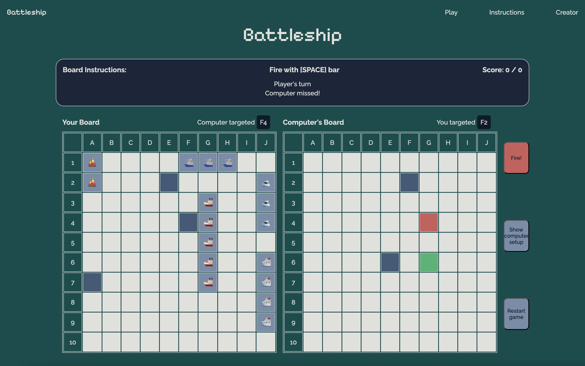
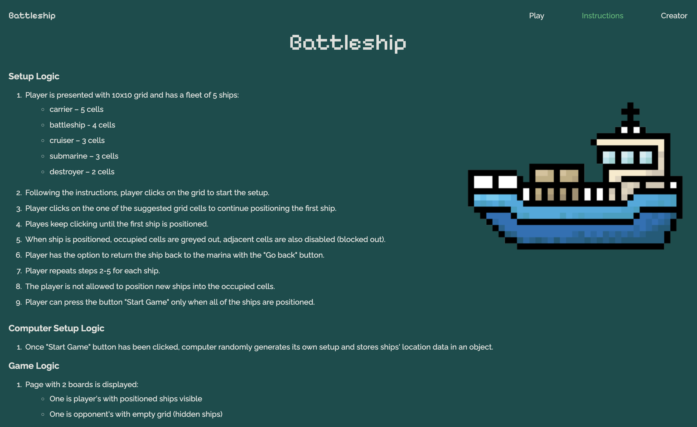
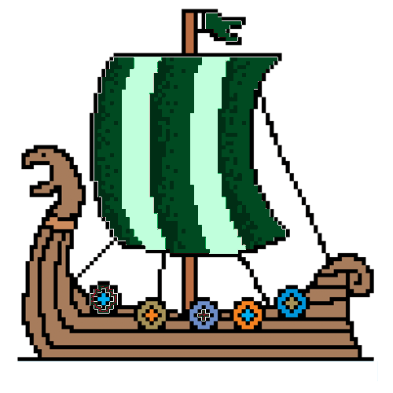

# Battleship


## Game

### Setup Logic
1. Player is presented with 10x10 grid and has a fleet of 5 ships:
    * carrier – 5 cells
    * battleship - 4 cells
    * cruiser – 3 cells
    * submarine – 3 cells
    * destroyer – 2 cells
2. Following the instructions, player clicks on the grid to start the setup.
3. Player clicks on the one of the suggested grid cells to continue positioning the first ship.
4. Playes keep clicking until the first ship is positioned.
5. When ship is positioned, occupied cells are greyed out, adjacent cells are also disabled (blocked out).
6. Player has the option to return the ship back to the marina with the "Go back" button.
7. Player repeats steps 2-5 for each ship.
8. The player is not allowed to position new ships into the occupied cells.
9. Player can press the button "Start Game" only when all of the ships are positioned.

### Computer Setup Logic
1. Once "Start Game" button has been clicked, computer randomly generates its own setup and stores ships' location data in an object.

### Game Logic
1. Page with 2 boards is displayed:
    * One is player's with positioned ships visible
    * One is opponent's with empty grid (hidden ships)
2. It is player's turn.
3. Player clicks on a cell in a 10x10 opponent's grid. To fire, player follows his first click with clicking the "Fire!" button or pressing SPACE bar.
4. A message is rendered (either "Hit!" or "Miss!"). "Fire" button greys out. The clicked cell is assigned a color (one for "Miss", another for "Hit").
5. It is opponent's turn.
6. Computer randomly chooses one cell to attack on the player's field. Computer has a built-in logic to target adjacent cells once it records a "Hit" on player's board until player's ship sinks.
7. A message is rendered (either "Hit!" or "Miss!"). Once player clicks on the next cell, "Fire" button is activated again.
8. Repeat steps 2-7.
9. If a computer's ship is completely out, it is revealed, all of its cells are assigned a color.
10. Once all of the ships are out for one of the players, "You won" or "Computer won" message is rendered.
11. Player can press "Restart game" button at any point in the game.
12. Player can't click on disabled cells to fire.
13. Player can click "Show computer setup" to see computer's hidden ships. Player can then hide their positions.

## Behind the Scenes

### Wireframe
Wireframe work was completed using Figma.


### Pages

Battleship game has multiple HTML templates. Besides the landing page (index.html), Battleship has:
* **Play-setup.html** – page to setup player's fleet.
* **Play.html** – main playing page where the player plays against computer.
* **Instructions.html** – page containing instructions on setup and play logic.
* **Winloss.html** – it is rendered when one player wins.

#### *Landing page*


#### *Play-setup page*

##### *Fleet setup*


#### *Play page*




#### *Win/loss page*


#### *Instructions page*


### Mobile versions

#### *Play-setup page on mobile*


#### *Play page on mobile*


#### *Instructions page on mobile*


### JS files

* Script.js

* Math.js


* Board-setup.js

* Reset.js

* Call-cell.js


## Future improvements

### Maximum Call Stack Error
The logic for the computer setup employs a recursive function that sometimes leads to maximum call stack error as it can't find the next cell for the ship. If it happens, reloading the page usually solves it, but ideally this needs to be debugged. 

What happens is that the game does not account for ships occupying other cells when it calculates orientation and adjacent cells. Imagine the situation below from a player setup:


After the carrier was set, battleship needs to occupy 4 cells. It technically can't go horizontally since there is not enough room. However, the code still suggests horizontal cell as an option. See what happens if we click on the horizontal cell:

A player can click GO BACK button in this situation and restart the building process of this specific ship.

The computer, however, does not have a GO BACK button. In this situation, it will keep looking for a cell to occupy via recursive function depicted below. It won't find any options and will exceed maximum call stack.

```javascript
    
    // render ships for computer
    function computerBoard() {
      
        //...picking the cell from available ones...
        
        if (shipsOnBoard === shipsComputer.length) {
            
            computerReady = true;
            console.log(aGrid);
            return true;

        } else {
            
            // recursive function (untill all ships are completed)
            computerBoard();

        }

    }
    
    computerBoard();
```

In order to solve this issue, I need to introduce another function that recalculates the available cells to ensure that the computer does not see starting cells with not enough room nearby as an option.

### Color values in JS
Colors below for ```fire``` and ```suggest``` keys do not properly work if passed as hex values. The ```unhighlightCells()``` function does not remove the color. If they are passed as simple string color names, everything works. Not sure why this is happening. Ideally, shamrock green color would replace the ```fire``` and ```suggest``` values.
```javascript
const colors = {
    block: "white",
    adjacent: "#415A77", 
    suggest: "mediumseagreen",
    board: "#E0E1DD",
    ship: "#778DA9", 
    button: "indianred",
    fire: "mediumseagreen", //#4DA167(shamrock green)
    hit: "indianred",
    miss: "#415A77", 
    dead: "#0D1B2A",
    firebutton: "grey",
    disabled: "grey" 
}
```

### Mobile
The mobile version of the game can be improved further. The grid is too large, and its cells do not maintain 1/1 aspect ratio. The appearance and related functionality need more work.

### Site menu – mobile
Site menu should shrink into a menu icon that displays a drop-down menu once clicked.

### Audio sounds
The game can employ various sounds to make it more entertaining. Sounds can differ based on whether the attack hit a ship or whether it sank a ship.

### Emojis
At this time, the game uses Unicode emojis to depict the ships. They are stored as strings and easily retrievable from the object depicted below.

```javascript
const ships = [
    {
        name: "carrier",
        length: 5,
        emoji: "🚢", 
        location: [],
        hits: 0,
        alive: true
    }
]
```
For the design improvement of the game, it would be great to use pixelated PNG emojis of the ships, similar to the one depicted below. However, it is not yet clear on how to store a retrievable PNG inside the object as a string without making it too complicated.





